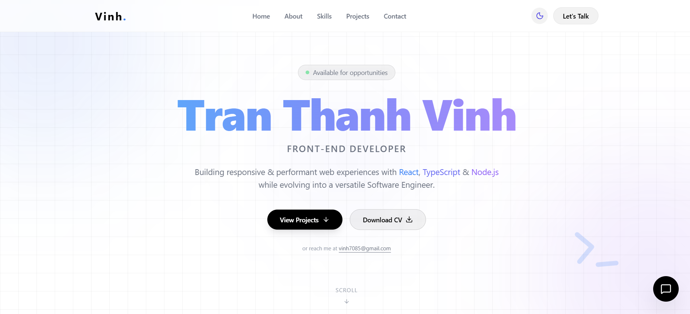

# 🚀 Modern React Portfolio - Vinh.

Một trang Portfolio cá nhân hiện đại, hiệu năng cao được xây dựng với **React 19**, **TypeScript**, và **Tailwind CSS**. Dự án tập trung vào trải nghiệm người dùng mượt mà, thiết kế Glassmorphism và khả năng tùy biến dữ liệu dễ dàng.



---

## ✨ Tính năng nổi bật

- 🌓 **Dark/Light Mode:** Chuyển đổi theme mượt mà với hiệu ứng xoay icon Sun/Moon.
- 📱 **Responsive Design:** Tối ưu hóa hiển thị trên mọi thiết bị (Mobile, Tablet, Desktop).
- 🍱 **Bento Grid Layout:** Phần "About" được thiết kế theo phong cách Bento hiện đại.
- 🎭 **Framer Motion:** Hiệu ứng chuyển động (animations) cao cấp, scroll reveal và hover effects.
- 🛠️ **Centralized Data:** Quản lý toàn bộ thông tin (projects, skills, contact) tại duy nhất một file `src/data/resume.ts`.
- ⚡ **Vite:** Tốc độ build và hot-reload cực nhanh.

---

## 🛠️ Công nghệ sử dụng

- **Frontend:** React 19, TypeScript
- **Styling:** Tailwind CSS v3 (Custom Grid Background)
- **Animation:** Framer Motion
- **Icons:** Lucide React
- **Build Tool:** Vite

---

## 🚀 Hướng dẫn cài đặt

Để chạy dự án này dưới máy cục bộ, hãy làm theo các bước sau:

1. **Clone repository:**
   ```bash
   git clone https://github.com/Vinhpc123/ThanhVinh-portfolio.git
   cd ThanhVinh-portfolio
   ```

2. **Cài đặt dependencies:**
   ```bash
   npm install
   ```

3. **Chạy môi trường phát triển (Dev):**
   ```bash
   npm run dev
   ```

4. **Build dự án (Production):**
   ```bash
   npm run build
   ```

---

## 📂 Cấu trúc thư mục

```text
src/
├── components/   # Các thành phần dùng chung (Header, Toggle...)
├── data/         # Dữ liệu trung tâm (resume.ts)
├── hooks/        # Custom hooks (useTheme.ts)
├── sections/     # Các phần chính của trang (Hero, About, Projects...)
├── styles/       # CSS toàn cục và cấu hình Tailwind
└── App.tsx       # Thành phần gốc của ứng dụng
```

---

## ✍️ Tùy chỉnh thông tin của bạn

Bạn không cần sửa code giao diện để thay đổi nội dung. Chỉ cần mở file:
`src/data/resume.ts`

Và cập nhật các thông tin cá nhân của bạn vào đó. Trang web sẽ tự động cập nhật mọi thứ!

---

**Cảm ơn bạn đã ghé thăm Portfolio của tôi!** 
Nếu bạn thấy dự án này thú vị, đừng quên tặng cho nó một ⭐ nhé! 

Kết nối với tôi tại: [vinh7085@gmail.com](mailto:vinh7085@gmail.com)
